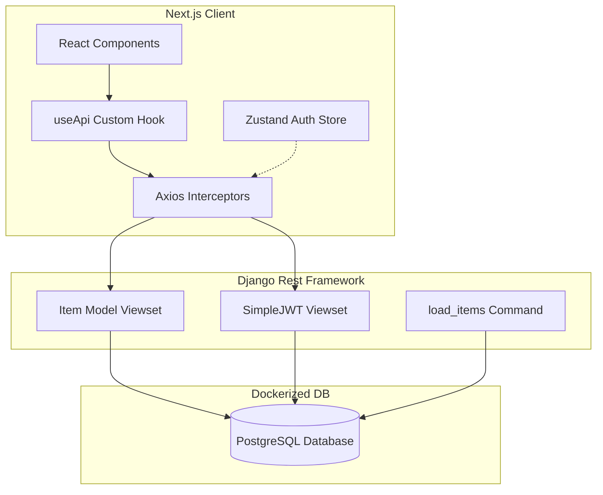
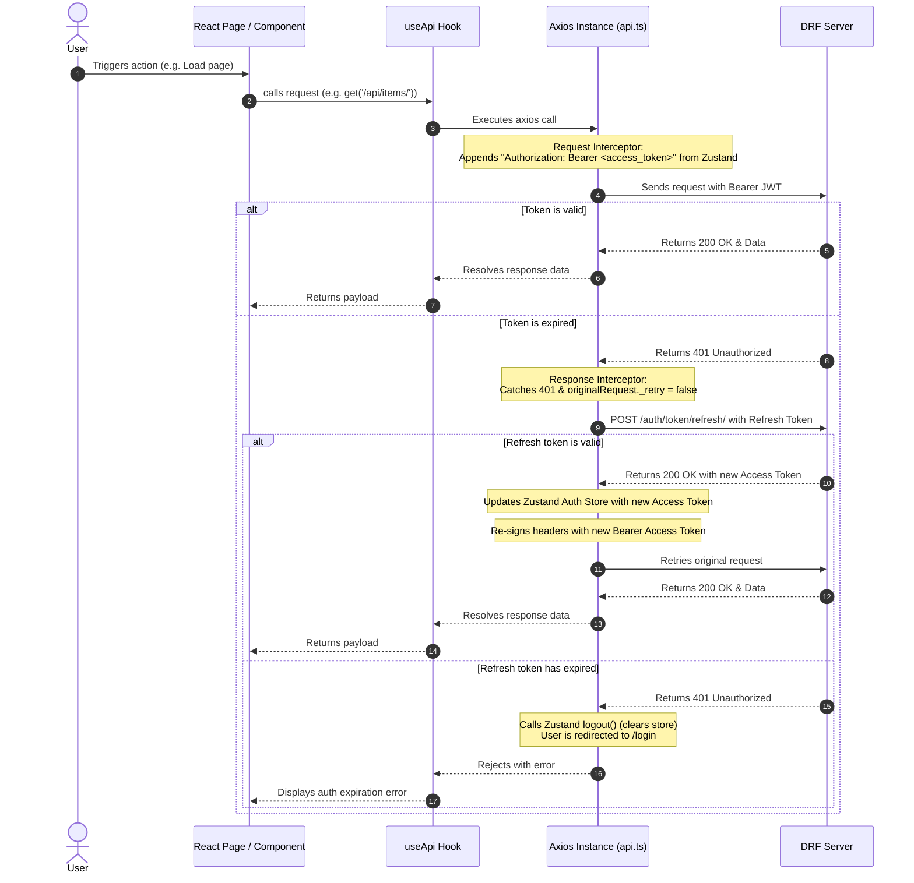

# Full-Stack Data Management Application

A full-stack application built with a **Next.js (TypeScript)** frontend and a **Django REST Framework (DRF)** backend, demonstrating JWT authentication, state management, containerized databases, and automatic token refresh interceptors.

---

## Project Architecture



---

## Getting Started

### Prerequisites
* [Node.js](https://nodejs.org/) (v18+)
* [Python 3.10+](https://www.python.org/)
* [Docker & Docker Compose](https://www.docker.com/)

---

### Part 1: Backend Setup (Django + DRF)

1. **Navigate to the backend directory**:
   ```bash
   cd backend
   ```

2. **Set up a Virtual Environment**:
   ```bash
   # Create a virtual environment
   python -m venv venv

   # Activate the virtual environment
   # On Windows (Command Prompt):
   venv\Scripts\activate
   # On Windows (PowerShell):
   .\venv\Scripts\activate
   # On Linux/macOS:
   source venv/bin/activate
   ```

3. **Install Python Dependencies**:
   ```bash
   pip install -r requirements.txt
   ```

4. **Spin up the PostgreSQL Database**:
   A `docker-compose.yml` file is provided to orchestrate the PostgreSQL service with data volumes attached to ensure database persistence.
   ```bash
   docker-compose up -d
   ```

5. **Initialize Database Migrations**:
   ```bash
   python manage.py makemigrations
   python manage.py migrate
   ```

6. **Seed Initial JSON Data**:
   A custom management command loads/merges data from `items.json` into the PostgreSQL table:
   ```bash
   python manage.py load_items
   ```

7. **Create a Superuser** (Required to log in and obtain JWT tokens):
   ```bash
   python manage.py createsuperuser
   ```

8. **Start the Django Server**:
   ```bash
   python manage.py runserver
   ```
   The backend API will be live at `http://localhost:8000`.

---

### Part 2: Frontend Setup (Next.js + TypeScript)

1. **Navigate to the frontend directory**:
   ```bash
   cd frontend
   ```

2. **Install Node Dependencies**:
   ```bash
   npm install
   ```

3. **Start the Development Server**:
   ```bash
   npm run dev
   ```
   The application will be live at `http://localhost:3000`.

---

## How the Custom `useApi` Hook Works

The application implements a robust, secure authentication and request flow using the custom `useApi` hook combined with Axios Interceptors and global Zustand state.



### Key Components

1. **Global Store (`authStore.ts`)**:
   Uses **Zustand** with `persist` middleware. It stores `accessToken` and `refreshToken` securely in localStorage and exposes `setTokens()` and `logout()` actions.

2. **Axios Interceptors (`api.ts`)**:
   * **Request Interceptor**: Plucks the current `accessToken` from the Zustand store and injects it into the HTTP header: `Authorization: Bearer <token>`.
   * **Response Interceptor**: Intercepts failed requests. If it catches a `401 Unauthorized` response, it pauses the request queue, sends a POST call to `{{BASE_URL}}/auth/token/refresh/` using the persisted `refreshToken`, saves the new access token, updates the headers, and seamlessly retries the original request. If the refresh token has also expired, it logs the user out and clears state.

3. **`useApi` Hook (`useApi.ts`)**:
   Provides a clean wrapper interface exposing standard CRUD request triggers (`get`, `post`, `put`, `delete`). It tracks local component-level states:
   * `loading`: `true` during active network transit (useful for showing spinners).
   * `error`: captures error message details returned by the DRF backend.

---

## Assumptions & Design Choices

1. **Database engine**: Utilizes PostgreSQL v17 running in Docker, configured dynamically via Django environment variables loaded from the `.env` file.
2. **Token Lifetimes**: Default `ACCESS_TOKEN_LIFETIME` is set to 15 minutes, and `REFRESH_TOKEN_LIFETIME` is set to 1 day to support realistic token expiry and automated refreshing testing.
3. **Route Guard**: The frontend dashboard utilizes a client-side layout guard hook `useRequireAuth` that monitors the Zustand store state; if authentication tokens are absent, users are immediately routed to `/login`.
4. **Data Synchronization**: The database items seed command (`load_items`) executes an `update_or_create` checking mechanism against the JSON dump so that subsequent runs do not result in duplicate records.
